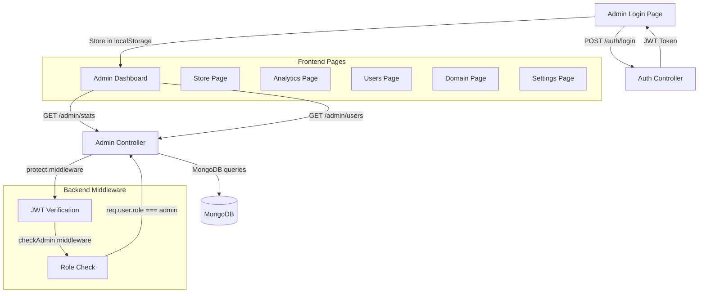

# NovaEdge Admin Webapp — Full-Stack Architecture Analysis

## Overview

The admin webapp is a **Next.js (App Router)** frontend backed by an **Express + MongoDB** API. Authentication uses JWT tokens stored in `localStorage`, gated by two middleware layers (`protect` + `checkAdmin`).

---

## Frontend Architecture

### Pages (7 total)

| Page | Route | Lines | Key Functionality |
|------|-------|-------|-------------------|
| [Login](file:///home/amit/Development/myProject/novaedge-digital-labs-app/admin-webapp/src/app/login/page.tsx) | `/login` | 144 | JWT auth, admin role check, glassmorphic UI |
| [Dashboard](file:///home/amit/Development/myProject/novaedge-digital-labs-app/admin-webapp/src/app/page.tsx) | `/` | 301 | Stats overview, recent signups, upgrade modal |
| [Store](file:///home/amit/Development/myProject/novaedge-digital-labs-app/admin-webapp/src/app/store/page.tsx) | `/store` | 867 | Product CRUD, deploy/edit forms, AnimatePresence modals |
| [Analytics](file:///home/amit/Development/myProject/novaedge-digital-labs-app/admin-webapp/src/app/analytics/page.tsx) | `/analytics` | 246 | Metrics visualization, CSV export, refresh |
| [Users](file:///home/amit/Development/myProject/novaedge-digital-labs-app/admin-webapp/src/app/users/page.tsx) | `/users` | 499 | User listing, role/status mgmt, registration form |
| [Domain](file:///home/amit/Development/myProject/novaedge-digital-labs-app/admin-webapp/src/app/domain/page.tsx) | `/domain` | 353 | Domain allow-listing, DNS records (mock), SSL status |
| [Settings](file:///home/amit/Development/myProject/novaedge-digital-labs-app/admin-webapp/src/app/settings/page.tsx) | `/settings` | 723 | 8-tab settings (General, Security, Notifications, Team, Cloud, API Keys, Database, Appearance) |

### API Client ([api.ts](file:///home/amit/Development/myProject/novaedge-digital-labs-app/admin-webapp/src/lib/api.ts))

```
BASE_URL → process.env.NEXT_PUBLIC_API_URL || "http://localhost:5000/api"
```

- **`authApi`**: `login()`
- **`adminApi`**: 14 methods covering stats, users, products, platform config, analytics, and API keys
- **Auth flow**: JWT from `localStorage`, 401 triggers `auth-error` custom event
- All requests use `Content-Type: application/json`

---

## Backend Architecture

### Admin Controller ([admin.controller.js](file:///home/amit/Development/myProject/novaedge-digital-labs-app/backend/src/controllers/admin.controller.js))
468 lines, **17 exported handlers**:

| Endpoint | Method | Handler | Purpose |
|----------|--------|---------|---------|
| `/admin/stats` | GET | `getStats` | User, course, lead, tool usage counts |
| `/admin/users` | GET | `getUsers` | All users (excludes password) |
| `/admin/user/:id` | PUT | `updateUser` | Update role, plan, isActive |
| `/admin/user/:id` | DELETE | `deleteUser` | Delete (self-delete blocked) |
| `/admin/user` | POST | `createUser` | Manual user creation |
| `/admin/platform-config` | GET | `getPlatformConfig` | Fetch latest config |
| `/admin/platform-config` | PUT | `updatePlatformConfig` | Update config |
| `/admin/analytics` | GET | `getAnalytics` | Latest analytics (seeds defaults if none) |
| `/admin/analytics/refresh` | POST | `refreshAnalytics` | Generate fresh random analytics |
| `/admin/products` | GET | `getAdminProducts` | All products |
| `/admin/products` | POST | `createProduct` | New product |
| `/admin/products/:id` | PUT | `updateProduct` | Update product |
| `/admin/products/:id` | DELETE | `deleteProduct` | Delete product |
| `/admin/api-keys` | GET | `getAdminApiKeys` | All API keys (populated user) |
| `/admin/api-keys` | POST | `createAdminApiKey` | Generate new key |
| `/admin/api-keys/:id` | DELETE | `revokeAdminApiKey` | Soft-revoke (sets `isActive: false`) |

### Routes ([admin.routes.js](file:///home/amit/Development/myProject/novaedge-digital-labs-app/backend/src/routes/admin.routes.js))
- All routes require `protect` → `checkAdmin` middleware chain
- Clean REST structure, properly organized by resource group

### Middleware

**Admin middleware** ([admin.middleware.js](file:///home/amit/Development/myProject/novaedge-digital-labs-app/backend/src/middleware/admin.middleware.js)):
```javascript
// Simple role check: req.user.role === 'admin'
```

### Models Used by Admin (7 of 28 total)

| Model | Used For |
|-------|----------|
| `User.model.js` | User CRUD, stats |
| `Course.model.js` | Course count for stats |
| `ToolUsage.model.js` | Tool usage aggregation |
| `Lead.model.js` | Lead count for stats |
| `PlatformConfig.model.js` | Platform settings |
| `Analytics.model.js` | Session/bounce/retention metrics |
| `Product.model.js` | Digital asset management |
| `ApiKey.model.js` | API key management |

---

## Admin Seed Scripts

Two scripts exist for bootstrapping admin accounts:

| Script | Admin Email | Password |
|--------|-------------|----------|
| [scripts/create_admin.js](file:///home/amit/Development/myProject/novaedge-digital-labs-app/backend/scripts/create_admin.js) | `admin@novaedge.io` | `AdminPassword123!` |
| [ensure-admin.js](file:///home/amit/Development/myProject/novaedge-digital-labs-app/backend/ensure-admin.js) | `amitkumarraikwar@novaedgedigitallabs.tech` | `adminpassword123` |

> [!CAUTION]
> Both scripts have **hardcoded plaintext credentials**. These should be moved to environment variables before production deployment.

---

## Identified Issues & Improvements

### ✅ Fixed
- **`domain/page.tsx` line 350**: `</Layout>` → `</AdminLayout>` — corrected

### 🔴 Critical
1. **Hardcoded admin credentials** in both seed scripts — use env vars
2. **No input validation** on `createProduct` — `req.body` passed directly to `Product.create()`
3. **`refreshAnalytics` generates random data** — not connected to real metrics pipeline

### 🟡 Medium
4. **No pagination** on `getUsers` — returns all users, will degrade at scale
5. **Settings page "Team Members" invite** creates user with `TemporaryPassword123!` hardcoded — should trigger email invite flow
6. **API Key creation** in Settings uses `prompt()` dialog — poor UX
7. **`updatePlatformConfig`** uses `Object.assign` — allows any field to be set, potential security risk
8. **Login stores user data in localStorage** — consider httpOnly cookies for security

### 🟢 Minor
9. **Cloud Sync & Database** settings tabs render "Coming Soon" placeholder
10. **Notifications tab** toggles are non-functional (hardcoded to enabled)
11. **`toPublicJSON`** method used with optional chaining — inconsistent model interface
12. **No CSRF protection** on the API client

---

## Data Flow Diagram



---

## Summary

The admin webapp is a well-structured full-stack application with a clean separation between frontend pages and backend API endpoints. The major areas needing attention are **security hardening** (credential management, input validation, auth token storage) and **scalability** (pagination, real analytics pipeline). The UI is consistent with its glassmorphic dark-themed design system across all 7 pages.
